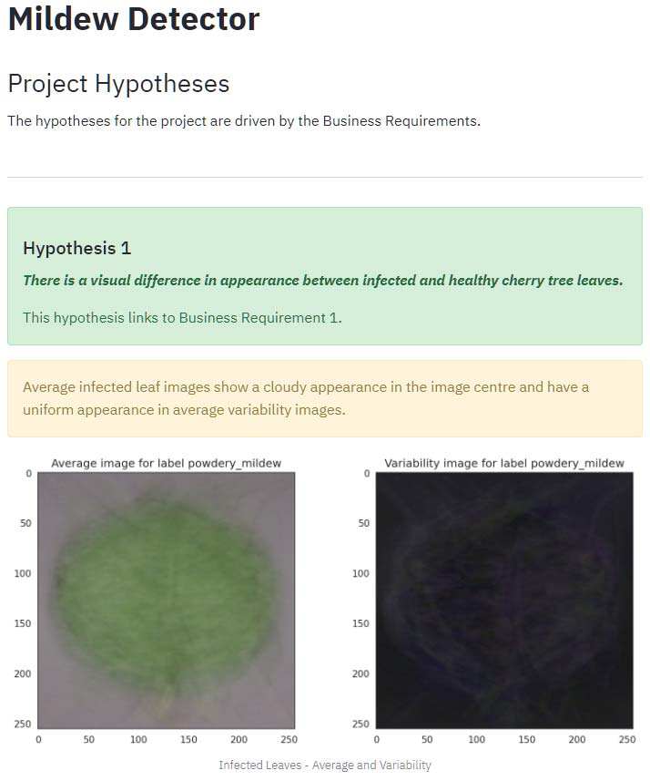

# **Mildew Detector - Introduction**

The Mildew Detector is a project which employs machine learning to teach
an algorithm to be able to make a prediction on whether a leaf is infected
with Powdery Mildew or not.

[View the live project here](https://mildewdetector-ef3bd4a41238.herokuapp.com/).

---

## **Table of Contents**

- [**Dataset Content**](#dataset-content)
- [**Business Requirements**](#business-requirements)
  - [*Business Requirement 1*](business-requirement-1)
  - [*Business Requirement 2*](business-requirement-2)
- [**Hypotheses**](#hypotheses)
  - [*Hypothesis 1*](#hypothesis-1)
  - [*Hypothesis 2*](#hypothesis-2)
- [**Rationale**](#rationale)
  - [*Data Visualisation*](#business-requirement-1)
  - [*Classification*](#business-requirement-2)
- [**ML Business Case**](#ml-business-case)
- [**Model Selection**](#model-selection)
- [**Dashboard Design**](#dashboard-design)
  - [*Navigation*](#navigation)
  - [*Summary*](#summary)
  - [*Leaves Visualiser*](#leaves-visualiser)
  - [*Mildew Detector*](#mildew-detector)
  - [*Hypotheses and Validation*](#hypotheses-and-validation)
  - [*ML Performance*](#ml-performance)
- [**CRISP-DM Workflow**](#crisp-dm-workflow)
- [**Future Developments**](#future-developments)
- [**Testing**](#testing)
- [**Bugs**](#bugs)
- [**Technologies Used**](#technology-used)
- [**Deployment**](#deployment)
- [**Credits**](#credits)

---

## **Dataset Content**

The dataset is made up of 4208 images of single cherry tree leaves, taken from
healthy trees and those infected with Powdery Mildew. Each of these 'labels' 
contains 2104 images, with an even split between healthy and infected.

The dataset is sourced from
[Kaggle](https://www.kaggle.com/codeinstitute/cherry-leaves).

---

## **Business Requirements**

The business requirements for the project are as follows:

- **Business requirement 1** -
***The client is interested in conducting a study to visually differentiate*** 
***a healthy cherry leaf from one infected with Powdery Mildew***.
- **Business requirement 2** - ***The client is interested in predicting if*** 
***a cherry leaf is healthy or infected with Powdery Mildew***.

The fictional company, Farmy & Foods, has a number of cherry tree plantations
and are experiencing problems with Powdery Mildew infections.

Powdery Mildew is a disease is caused by *Podosphaera clandestina*, one of the
common species of the Powdery Mildew group of fungi. The disease affects
cherry trees, damages and stunts new leaf growth and can affect crop return in
commercial settings. The same fungus reportedly causes Powdery Mildew in
peaches, apricots, apples and pears.

Currently, the company process to detect this infection involves manual
checking of the cherry tree leaves. An employee spends around 30 minutes in
each tree, taking a few samples of leaves and visually deciding if the leaf
tree is healthy or has Powdery Mildew. If infection is suspected, the
employee applies a chemical compound to kill the fungus. The time spent
applying this compound is 1 minute.

The company has thousands of cherry trees, located on multiple farms across
the country. As a result, this manual process is not scalable due to the
time spent in the manual process inspection.

To save time, the IT team have suggested a Machine Learning system that
detects instantly, using an image of a leaf, if the tree is healthy or has
Powdery Mildew. A similar manual process is in place for other crops for
detecting pests, and if this initiative is successful, there is a realistic
chance to replicate this project for other crops.

The dataset is a collection of cherry leaf images, provided by the client
from their plantations.

---

## **Hypotheses**

### **Hypothesis 1**

*There is a visual difference in appearance between* 
*infected and healthy cherry tree leaves.*

- Business requirement 1 requires a study to visually differentiate a healthy
  leaf from an infected one.
- The hypothesis will be investigated with an average image study.

### **Hypothesis 2**

*It is possible to train a model to predict, with at least 97% accuracy,* 
*if an image of a cherry tree leaf is infected with powdery mildew.*

- Business requirement 2 is that the client wants to predict if a cherry tree
  is infected or healthy, with at least 97% accuracy.
- The hypothesis will be tested by training a model on the train and test
  images and calculating the accuracy with a validation set.

---

## **Rationale**

The business requirements have been matched to the tasks using the CRISP-DM 
workflow steps.  
User Stories can be found, along with Tasks, grouped into Epics matching the 
CRISP-DM workflow, on the project board here: 
[Mildew Detector Project Board](https://github.com/users/broken-helix/projects/9)

### **Business Requirement 1**

#### **Data Visualisation**

##### *User Stories*

- As a **client** I can
  **visually differentiate a healthy from an infected leaf** so that
  **I can visually determine if leaves are infected or not**.
- As a **client** I can
  **view the difference between average healthy and infected leaves** so that
  **I can compare leaves**.
- As a **client** I can
  **display a montage of images of infected and healthy leaves**
  so that **I can see differences between them**.

##### *Related Tasks*

- Calculate standard deviation and mean of infected and healthy leaf images.
- Display on the Streamlit dashboard, average and average variability images
  for infected and healthy leaves.
- Display differences between healthy and infected leaves on the Streamlit
  dashboard.
- Create an image montage viewer on the Streamlit dashboard to display a
  selection of either healthy or infected leaf images.

### **Business Requirement 2**

#### **Classification**

##### *User Stories*

- As a **client** I can
  **determine that the Machine Learning Model is accurate to at least 97%**
  so that **I can be sure the results are accurate**.
- As a **client** I can **upload an image of a cherry tree leaf** so that
  **I can get an indication of whether it is infected or healthy**.
- As a **client** I can **download a report** so that
  **I can view the results outside of the dashboard environment**.

##### *Related Tasks*

- Build a binary classifier.
- Validate the accuracy of the model with the validation set.
- Display the results on the Machine Learning Performance page of the Streamlit
  dashboard.
- Use the model to create the Mildew Detector page of the Streamlit dashboard.

---

## **ML Business Case**

- An ML model is required to predict if a leaf is infected with Powdery Mildew
  or not, based on the provided dataset. The problem is a binary one. The 
  leaf is either infected or healthy and requires a
  **supervised, 2-class, single-label, classification model**.
- The ideal outcome is to provide the company with a faster and more reliable
  detector for Powdery Mildew detection.
- The model success metrics are an **accuracy of 97% or above** on the test set.
- The model output is defined as a flag, indicating if the leaf has Powdery
  Mildew or not and the associated probability of being infected or not.
  The workers will take a picture of a leaf and upload it to the App.
- Heuristics: The current detection method is based on a manual inspection.
  Visual collection and inspection is slow and it leaves room to produce
  inaccurate diagnostics due to human error.
- The training data to fit the model comes from the leaves database provided by
  Farmy & Foody company and uploaded on Kaggle. This dataset contains 4208
  images of cherry leaves.

---

## **Model Selection**

- As set out in the **ML Business Case**, the required model is
  a **supervised, 2-class, single-label, classification model**.
- The selected model (v1) was one of three explored with the available data.
- Each model used a different optimiser:
  - v1 - Adagrad
  - v2 - Adadelta
  - v3 - Adam
- The selected model (v1) was chosen for its accuracy while not overfitting.
- The models trialed are discussed further
  in the [Model Selection Readme](MODELSELECTION.md).

---

## **Dashboard Design**

### **Navigation**

Streamlit MultiPage was used to group 5 pages into one dashboard with a menu.

### **Summary**

The *summary* page contains a brief summary of the project, together with
three sections:

- **Disease Information**. Information about Powdery Mildew disease,
  its causes, symptoms and life cycle.
- **Business Requirements**. The requirements of the client for a successful
  outcome to the project.
- **Project Dataset**. A summary of the dataset details.

### **Leaves Visualiser**

**This page handles Business Requirement 1**  
The *leaves visualiser* page displays a brief summary and three checkboxes 
which load up the relevant image display:

- Difference between average and variability image.
- Differences between average infected and average healthy leaves.
- Image Montage of either healthy or infected leaves.

### **Mildew Detector**

**This page handles Business Requirement 2**  
The *mildew detector* page shows an information section, together with
instructions on how to use the detector and a link to sample images.
When an image is uploaded, a report is generated which displays:

- A display of the image.
- A message indicating the model prediction.
- A probability chart.
- A downloadable report.

### **Hypotheses and Validation**

The *hypothesis* page presents the hypotheses for the project, the 
business requirement they are targeted towards, results of the analysis 
and conclusions for each model.

### **ML Performance**

**This page handles Business Requirement 2**  
The Label Frequency charts for train, test and validation sets confirm how the 
data was split for training and validating the model.  
The model history, accuracy, losses and confusion matrix are shown in the figures below the label frequency displays.  The accuracy is measured at greater than 97%, satisfying part of the requirements of Business Requirement 1.

---

## **CRISP-DM Workflow**

User stories were created to handle and plan aspects of the project which form 
part of the business requirements of the client.  These were mapped to Epics covering the stages of the CRISP-DM workflow.

Additionally, a series of tasks were created, covering the main steps in 
building the project.

The Epics cover the stages of CRISP_DM:  
  
- Business Understanding
- Data Understanding
- Data Preparation
- Modelling
- Validation

All stories and tasks are organised on the 
[project board](https://github.com/users/broken-helix/projects/9)

---

## **Future Steps**

- The model could be trained on other species.
- The model would be best incorporated into a mobile app to get instant 
  results in the field.

---

## **Testing**

- All pages have been tested to ensure they load and any features work as 
  expected and no errors are produced.
- The menu has been used to navigate between pages, ensuring 
  the links work as expected.
- The streamlit pages have been copied into the CI PEP8 checker and all code 
  passed with no errors.

---

## **Bugs**

One image, infected with Powdery Mildew, was found to be predicted as healthy
during testing. This is a part of machine learning, as overfitting is
avoided while trying to get a high accuracy. The confusion matrix shows 
that 8 out of 422 images of infected leaves were predicted to be healthy.  
However, it may be possible to further tune the model to reduce false
predictions, if the client feels this is more important.  Additionally, it may 
be possible to require 2-3 leaf images per tree, to reduce the likelihood of 
false readings for infected leaves.  
These are future conversations to have with the client once the dashboard 
prototype is deployed.

---

## **Technologies Used**

- [Git](https://git-scm.com/) 
  Used for version control alongside GitHub.
- [GitHub](https://github.com/) 
  Used to store the project and utilise git version control.
- [Heroku](https://id.heroku.com) 
  Used to deploy project.
- [CI PEP8 Testing](https://pep8ci.herokuapp.com/) 
  Used to validate all Python code.

---

## **Deployment**

### **Create Github Repository**

- Log in to your Github account.
- Navigate to repositories and select 'New'.
- Select the 'Code Institute' template from the 'Repository Template' menu.
- Give your repository a name and select 'Create Repository'.
- When the repository has been created select 'Gitpod' to open a new workspace.

### **Heroku**

- Log in to your Heroku account [Heroku](https://id.heroku.com).
- From the home page select 'New', then select 'Create New App' from
  the drop-down.
- Provide a name for your app and select your region.
- At the top of the page select the 'Deploy' tab.
- For the preferred deployment method select 'Github'.
- Search for your repository name and connect.
- Additionally, automatic deploys can be enabled for deployment after
  each push to Github.

### **Fork this project**

- Sign in to Github and go to my
  [repository](https://github.com/broken-helix/mildew-detector)
- At the top of the page select 'Fork'.
- The Fork will now be added to your repositories.

### **Clone this project**

- Sign in to Github and go to my
  [repository](https://github.com/broken-helix/mildew-detector)
- Select the green 'Code' button.
- Select from one of the cloning options HTTPS, SSH or Github CLI.
  Click the clipboard icon to copy the URL.
- Open git bash
- Enter ‘git clone’ into the text box and then paste the respository
  URL and select enter.

For more information on cloning please read the github documentation
[here](https://docs.github.com/en/repositories/creating-and-managing-repositories/cloning-a-repository)

---

## **Credits**

- [The Code Institutes](https://codeinstitute.net/) 'Malaria Detector'
  walkthrough project which inspired the main functionality of the application.
- [Stack Overflow](https://stackoverflow.com/) for help with errors
  encountered during development.
- [W3Schools - Python](https://www.w3schools.com/python/) for reference
  and research.
- My [Code Institute mentor](https://github.com/mshami).
- I was able to get some inspiration about potential structures for the project 
  from the following previous student repositories, supplied by my mentor for 
  information.
  - [Lemon Quality Control](https://github.com/Dante-Cadiz/lemon-qualitycontrol).
  - [Cherry Powdery Mildew Detector](https://github.com/cla-cif/Cherry-Powdery-Mildew-Detector)
- Background information on the disease was sourced from: 
  https://extension.psu.edu/powdery-mildew-of-cherry-and-plum-in-home-fruit-plantings
- The main image is by Pedro Sanz, sourced from 
  [Unsplash](https://unsplash.com/photos/fd4KegLUgOA).
